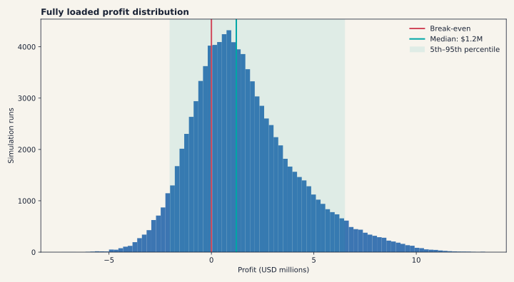
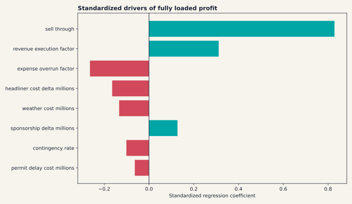
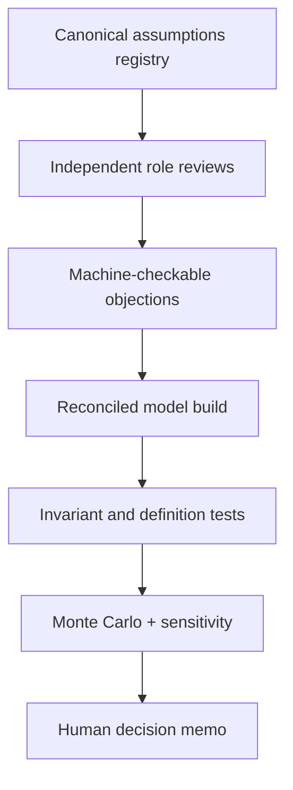

# The AI Boardroom That Killed a $65M Forecast

> A case study in adversarial AI roles, financial-model reconciliation and the
> source-of-truth problem hiding inside impressive agent output.

> **Generate boldly. Validate cheaply. Kill ruthlessly. Scale what survives.**

## Context and authorship

I built this work independently in **Houston, Texas**, as the solo founder and
only human product designer/developer at MidnightDev. The chronology runs from
December 2025 through this reproducible reconstruction in July 2026.

AI systems generated research, code, criticism and artifacts under my
direction. I defined the problems, created the synthetic roles, chose what to
build, reconciled conflicting outputs and owned every release decision.

One supporting experiment used the open-source project now called OpenClaw.
That upstream system was created by Peter Steinberger and its community; I used,
configured and modified a private working copy. I do **not** claim authorship of
their codebase.

## The chronological spine

| Date | Houston solo-dev experiment | What changed |
|---|---|---|
| Dec. 8, 2025 | Synesthetic Soundscapes package committed | A real World Cup-timed festival concept became an AI-built operating universe |
| Dec. 25, 2025 | Six-seat synthetic boardroom | Adversarial review rejected the approximately $65.9M forecast and rebuilt the operating-partner case |
| Jan. 29–30, 2026 | Moltbot/ClawdBot working copy | I explored agent-runtime build, CI, voice-safety and memory changes as the upstream project became OpenClaw |
| Feb. 15, 2026 | K2 OpenClaw operating workspace | Heartbeats detected PRs, delegated local validation and monitored Jules sessions |
| Mar. 7–11, 2026 | Diggs Money OS | The experiment expanded into a 21-role synthetic company with executive review, specialist squads, an event spine and mission ledger |
| Mid-2026 | Shipped consumer AI products | Production work moved toward deterministic scoring, human-confirmed truth and explicit safety gates |
| Jul. 28, 2026 | Public forecast reconstruction | Seeded Monte Carlo analysis, regression sensitivity and invariant tests made the boardroom lesson reproducible |

The [orchestration design evolution](docs/orchestration-evolution.md) separates
what I authored from what I configured, extended or reconstructed.

## The short version

In December 2025, I used AI to develop an end-to-end operating plan for a real
Houston music-festival concept intended to run during the 2026 FIFA World Cup.
This was not a classroom exercise: I was testing whether an actual venture
deserved capital and execution. The first financial model looked spectacular:
approximately **$65.9 million of projected profit**.

It was also fantasy math.

The problem was not that the entire cost stack was fictional. Most expense
lines were grounded in concrete event-planning inputs: production, artists,
security, medical staffing, venue and permits, insurance, labor, marketing and
operations. A smaller number of costs were inflated, duplicated or incorrectly
scaled and later normalized. The explosive first forecast came primarily from
unsupported revenue logic—including an approximately **$51.2M on-site F&B
projection**—rather than wholesale invention of the expense side.

I designed and created a synthetic diligence room with six functional
lenses—finance, operations, industry analysis, legal, marketing and investor
diligence—and forced the proposal through competing objections. The review cut
unsupported revenue, retained grounded expenses, normalized inflated costs,
added missing operating costs and reduced the headline to a reported
**$5M–$7M base-case range**.

That correction was valuable, but it was not the end of the story. A later
source-of-truth audit found that the “corrected” workbook still mixed two
expense definitions:

| Base case | USD millions |
|---|---:|
| Revenue | $25.294 |
| Expense used to produce reported profit | $18.872 |
| Reported profit | $6.422 |
| Displayed total expense, including contingency | $22.269 |
| Fully loaded profit | **$3.025** |
| Definition gap | **$3.397** |

The gap was exactly the 18% contingency reserve. The agents improved the
assumptions, yet incompatible definitions survived the consensus.

The project had real commercial intent, but the figures in this repository are
planning forecasts—not operating results from a staged event.

## Why this belongs in an applied-AI portfolio

The useful capability was not “generating 155 files.” It was learning how to:

- assign competing objectives to AI reviewers;
- convert objections into explicit variables and model changes;
- preserve minority/downside views instead of averaging them away;
- reconcile outputs against arithmetic invariants;
- label simulated evidence and real evidence differently; and
- recognize that an agent team still needs a canonical source of truth.

The history was not a tidy march from simple to sophisticated. The focused
six-seat boardroom came first. I then experimented with an always-on OpenClaw
operating layer and expanded role specialization into Diggs' 21-character
synthetic company. That breadth exposed a harder truth: more roles can produce
more coverage and more theater at the same time. My production systems now let
models propose and challenge, while deterministic gates, explicit authority
boundaries and canonical data decide what ships.

## The boardroom

| Seat | Question it owned | Material effect |
|---|---|---|
| CFO | Do pricing, fees and ancillary revenue survive scrutiny? | Reduced speculative FIFA revenue and increased reserve discipline |
| COO | Can this be operated safely at the proposed scale? | Raised security, medical and operational costs |
| Industry analyst | Are comparables and sell-through plausible? | Reframed the base case as aggressive rather than conservative |
| Legal counsel | Which liabilities and compliance costs are missing? | Added insurance, legal, permit and delay exposure |
| Marketing strategist | What must be paid to create Year 1 demand? | Replaced assumed organic demand with a real acquisition budget |
| Investor diligence | What happens to capital in the downside? | Added return scenarios, cash-flow timing and downside tests |

I created every seat. They were **synthetic AI roles**, not real executives,
operators or investors and not endorsements by any outside organization.

Read the detailed [boardroom reconstruction](docs/boardroom-reconstruction.md).

## Reproducible reconstruction

The historical repository preserved scenario and sensitivity work, but it did
not preserve executable Monte Carlo or regression code. This repository rebuilds
those methods transparently from the surviving scenario points.

The model runs 100,000 seeded trials across:

- sell-through;
- revenue execution;
- expense overruns;
- contingency reserves;
- sponsorship variance;
- headliner cost variance;
- weather shocks; and
- permit-delay shocks.

The expense distributions stress-test variance around the grounded planning
costs; they do not assume that every historical cost was invented.

It then fits a standardized multivariate regression against fully loaded profit
to rank which uncertain inputs drive the modeled outcome.

```bash
python -m venv .venv
source .venv/bin/activate
pip install -e .
boardroom-audit
python -m unittest discover -s tests -v
```

The test suite checks reconciliation invariants, deterministic simulation
output, probability bounds, contingency treatment, regression behavior and
drift between the committed results and a fresh seeded run. CI runs the same
tests on every push.

Generated outputs:

- `results/summary.json`
- `results/standardized_regression.csv`
- `results/profit_distribution.svg`
- `results/driver_importance.svg`

## Results



Under the disclosed assumptions and seed:

| Fully loaded outcome | Result |
|---|---:|
| Median profit | **$1.22M** |
| Mean profit | **$1.59M** |
| 5th–95th percentile | **–$2.02M to $6.50M** |
| Probability of any profit | **72.0%** |
| Probability of at least $3M | **25.0%** |
| Probability of at least $5M | **10.5%** |

The old $5M–$7M “base case” is therefore possible, but it is not the center of
the reconstructed fully loaded distribution.



Sell-through is the dominant modeled driver, followed by revenue execution,
expense overruns and headliner cost variance. The standardized regression has an
in-sample R² of **0.930**. That number describes this simulation—not the real
world—and is reported only as a diagnostic of model behavior.

The committed results are deterministic under seed `20251225`. They are
illustrative decision analysis—not audited financial guidance.

## What I would build differently now



The key improvement is between review and synthesis: no role can directly edit
the headline model. Each role submits a structured objection with an assumption
ID, evidence class, proposed range and expected effect. A deterministic build
then regenerates every view from one schema and blocks release if totals do not
reconcile.

## Evidence discipline

The original private repository remains private. It includes confidential
meeting material, simulated contact data, sensitive historical configuration
and contradictory drafts. The public case study uses a
[claim-level evidence ledger](docs/evidence-ledger.md) instead of dumping the
archive online.

The supporting ClawdBot, OpenClaw and Diggs repositories also remain private.
This case uses sanitized, attribution-safe excerpts from them; it does not
republish credentials, personal agent memory, operational identifiers,
lead/contact data or upstream code.

Read [claims and limitations](docs/claims-and-limitations.md) before reusing the
analysis.

## About

Built by **Alex Bouchard**, an applied AI product engineer and solo founder at
MidnightDev. This is a secondary portfolio case study about AI-assisted
decision systems; my primary work is shipped consumer AI across web and iOS.
